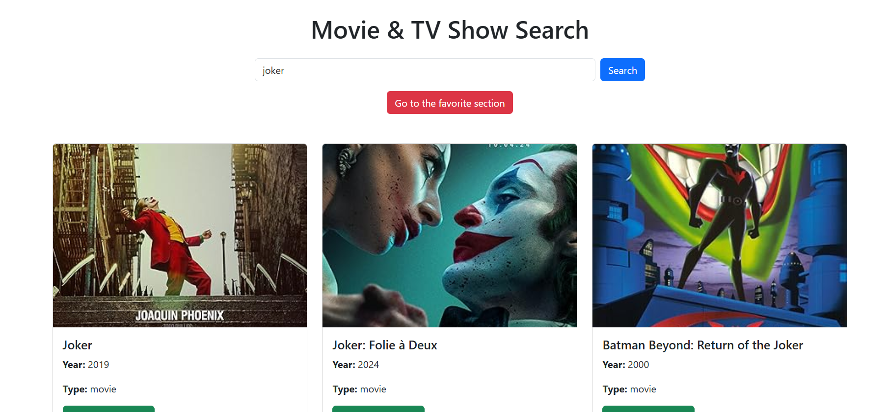
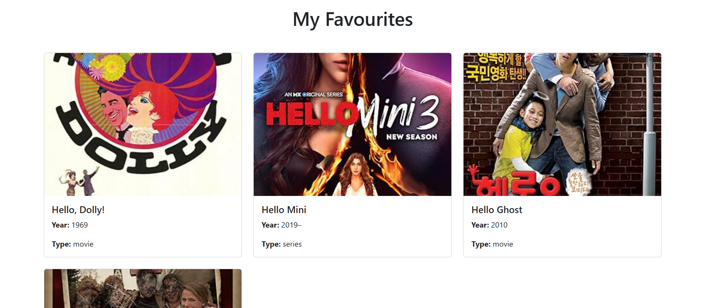

# for install you have to do
git clone  https://github.com/amit-vis/slashhas.git
cd ./interview

## then you have to do 
npm i 
## after that 
npm start

## then your project will run on port 8000

for fetch the api you have to
* /api/search[get]
* /api/favourites[post]
* /api/favourites[get]

# for view the page
## access the search page
/

## access the favourites page
/favourites

